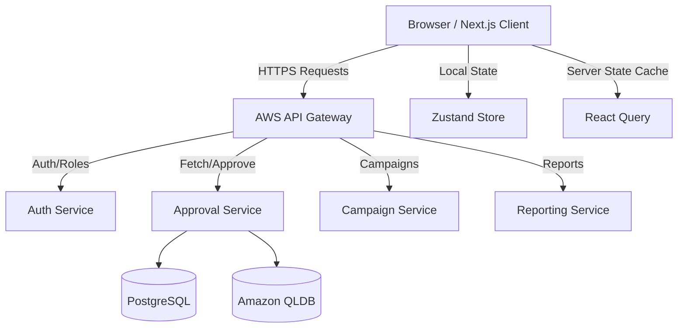

# KapuLetu Frontend Architecture & Design Document

## 1. Executive Summary

The KapuLetu Frontend is a modern, responsive, and highly interactive web application designed to serve as the control center for Community Treasurers. It acts as the primary interface for managing the backend's serverless orchestration layer. The frontend will allow treasurers to review pending transactions, allocate splits, manage campaigns, and view generated reports, while delivering a "wow" factor through premium design aesthetics.

## 2. Technology Stack

To ensure scalability, performance, and a premium developer/user experience, the frontend will be built on the following stack:

- **Core Framework**: [Next.js (App Router)](https://nextjs.org/) - For SSR/SSG capabilities, file-based routing, and optimal SEO/performance.
- **Language**: TypeScript - For end-to-end type safety and robust developer experience.
- **Styling & Design System**: 
  - **Vanilla CSS / CSS Modules**: For maximum flexibility, paired with custom CSS variables (Design Tokens) to manage the theme.
  - **Tailwind CSS** *(Optional but recommended if requested)*: For rapid utility-first styling.
  - **Framer Motion**: For dynamic, fluid micro-animations and page transitions to give the app a "living" feel.
- **State Management**:
  - **Server State**: [TanStack Query (React Query)](https://tanstack.com/query/latest) - For data fetching, caching, synchronizing, and updating server state (e.g., fetching pending transactions, campaigns).
  - **Client State**: [Zustand](https://docs.pmnd.rs/zustand/getting-started/introduction) - For lightweight, fast global client state (e.g., UI toggles, active modals, multi-step allocation forms).
- **Form Handling**: React Hook Form + Zod - For performant, type-safe form validation (campaign creation, member registration).
- **Authentication**: NextAuth.js or AWS Amplify (Cognito) - To integrate with the backend's role-based access control (RBAC).

## 3. High-Level Architecture

The frontend communicates with the AWS API Gateway, which routes requests to the respective Lambda services (Ingestion, Approval, Reporting, Members, Campaigns).



## 4. Folder Structure & Organization

The Next.js `app` directory structure enforces clean separation of concerns:

```text
kapuletu-frontend/
│
├── app/                        # Next.js App Router (Pages & Layouts)
│   ├── (auth)/                 # Auth-related pages (Login, Register)
│   ├── dashboard/              # Treasurer Dashboard (Main UI)
│   │   ├── inbox/              # Pending transactions for review
│   │   ├── campaigns/          # Campaign management
│   │   ├── members/            # Member management
│   │   └── reports/            # Financial reporting and exports
│   ├── layout.tsx              # Root layout (Providers, Global Nav)
│   └── page.tsx                # Landing Page
│
├── components/                 # Reusable React Components
│   ├── ui/                     # Base UI components (Buttons, Inputs, Modals - "Design System")
│   ├── layout/                 # Sidebar, Topbar, PageWrappers
│   ├── features/               # Complex feature components
│   │   ├── approval-queue/     # Transaction card, Split Allocation UI
│   │   └── analytics/          # Charts and data tables
│
├── lib/                        # Core Utilities
│   ├── api.ts                  # Axios/Fetch instances & interceptors
│   ├── utils.ts                # Formatting helpers (currency, dates)
│   └── design-tokens.css       # Core CSS variables (colors, typography)
│
├── hooks/                      # Custom React Hooks
│   ├── useTransactions.ts      # React Query hooks for transactions
│   ├── useAuth.ts              # Auth context wrapper
│   └── useMediaQuery.ts        # Responsive helpers
│
├── store/                      # Global Client State
│   └── ui-store.ts             # Zustand store for sidebars, modals
│
├── types/                      # TypeScript Interfaces
│   ├── backend.d.ts            # Types mirroring backend schemas (Pydantic)
│   └── ui.d.ts                 # UI-specific types
│
└── public/                     # Static assets (Images, Icons)
```

## 5. Core Views & Components

### A. The Approval Inbox (The Core Workflow)
The most critical part of the application. It lists pending transactions parsed from Twilio/WhatsApp.
- **Transaction Card**: Displays Sender, Amount, Parsed Code, and Timestamp.
- **Action Bar**: Vibrant buttons for `Approve`, `Reject`, `Edit`, and `Split`.
- **Split Allocation Modal**: A dynamic form allowing the treasurer to distribute a single payment across multiple contributors or campaigns.

### B. Dashboard Overview
- **Metric Cards**: Quick glaces at "Total Funds Raised", "Pending Approvals", "Active Campaigns".
- **Recent Activity Feed**: A real-time (or polled) list of recently approved transactions flowing into the QLDB ledger.

### C. Campaign Manager
- A visual board of active campaigns with progress bars against their financial goals.

### D. Reporting & Analytics
- Data tables with robust filtering, sorting, and export functionalities (CSV/PDF).

## 6. Design System & Aesthetics (The "Wow" Factor)

To ensure the application feels premium, modern, and trustworthy:

1. **Color Palette**: 
   - Move away from flat enterprise colors.
   - Use a sleek, dark mode by default with vibrant accents (e.g., Neon Teal for approvals, deep purple for backgrounds) or a hyper-clean "glassmorphism" light mode.
   - *Example Tokens*: `--bg-primary: #0F172A`, `--accent-primary: #10B981` (Emerald).
2. **Typography**: 
   - Implement `Inter` or `Outfit` from Google Fonts for a crisp, geometric look that reads well on data-heavy tables.
3. **Micro-animations (Framer Motion)**:
   - **Hover States**: Cards elevate slightly with a soft glow when hovered.
   - **Success States**: Approving a transaction triggers a subtle, satisfying checkmark animation and gracefully slides the card out of the queue.
   - **Page Transitions**: Smooth fades when navigating between the Inbox and Reports.
4. **Data Visualization**:
   - Use libraries like `Recharts` or `Chart.js` with customized, gradient-filled line charts to display financial growth over time.

## 7. Data Flow Strategy

1. **Fetching Pending Data**: `useQuery` fetches pending transactions. The data is cached.
2. **Treasurer Action**: Treasurer clicks "Approve". 
3. **Optimistic UI Update**: Before the server responds, `React Query` optimistically removes the transaction from the inbox UI to provide instant feedback.
4. **Server Mutation**: `useMutation` sends a POST request to the API Gateway (`/approval/approve`).
5. **Revalidation**: On success, the cache is invalidated, ensuring the Dashboard metrics update to reflect the newly ledgered funds.

## 8. API Contracts & Data Models

The frontend will heavily rely on strict typing mirroring the backend Pydantic schemas. Below are the core API contracts that the frontend must implement and validate using `zod` and `TypeScript` interfaces:

### A. Ingestion API
- **Endpoint**: `POST /ingestion`
- **Purpose**: Primarily used by Webhooks (Twilio), but the frontend may use it for manual transaction entry.
- **Payload**:
  ```typescript
  interface IngestionSchema {
    message: string;
    phone: string;
  }
  ```

### B. Approval API
- **Endpoint**: `POST /approval`
- **Purpose**: Used in the Treasurer Dashboard's Approval Inbox to finalize or reject transactions.
- **Payload**:
  ```typescript
  interface ApprovalSchema {
    transaction_id: string;
    action: 'approve' | 'reject' | 'edit' | 'split';
  }
  ```

### C. Campaigns API
- **Endpoint**: `ANY /campaigns` (GET for listing, POST for creation)
- **Purpose**: Managing fundraising goals.
- **Payload (Creation)**:
  ```typescript
  interface CampaignSchema {
    name: string;
    goal: number;
    description?: string;
  }
  ```

### D. Members API
- **Endpoint**: `ANY /members` (GET for listing, POST for creation)
- **Purpose**: Managing contributors and group members.
- **Payload (Creation)**:
  ```typescript
  interface MemberSchema {
    name: string;
    phone: string;
    group_id?: string;
  }
  ```

## 9. Security & Optimization

- **Role-Based Routing**: Next.js Middleware will ensure only authenticated users with the `Treasurer` role can access the `/dashboard` routes.
- **SEO & Meta**: Though a dashboard, landing pages will implement strict SEO best practices using Next.js Metadata API.
- **Responsive Design**: The UI will be fully usable on mobile, as treasurers may need to approve transactions on the go.

## 10. Future Roadmap Support
The architecture is designed to easily accommodate backend future enhancements:
- **Member Portal**: Can be added as a separate route group `app/(members)` with its own layout.
- **Payment Links**: A public-facing route `app/pay/[campaignId]` for external donors.
