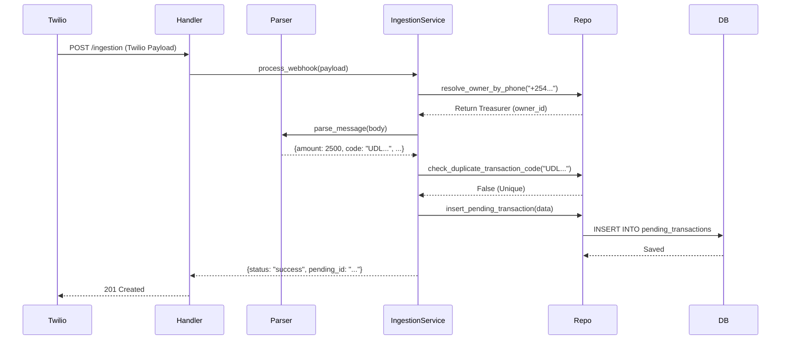

# 📥 Kapuletu Ingestion Module: Implementation Walkthrough

## 1. Module Overview
The Ingestion Module transforms unstructured communication from Treasurers (via Twilio/WhatsApp) into structured, auditable financial events. It enforces **Multi-tenancy** (owner_id resolution) and **Financial Integrity** (Idempotency).

### 📂 File Structure
```text
services/ingestion/
├── handler.py          # Twilio entry point (Lambda interface)
├── service.py          # Business logic & Orchestration
├── parser_engine.py    # Regex/NLP parsing logic
└── validators.py       # Payload validation logic
repositories/
└── transaction_repo.py # DB access layer
```

---

## 2. Example Twilio Webhook Payload
Twilio sends data as `application/x-www-form-urlencoded`. The handler converts this to a Python dictionary.

**Raw Incoming (Form Data):**
```text
ToCountry=KE&ToState=&SmsMessageSid=SM...&NumMedia=0&ToCity=&FromZip=&SmsSid=SM...&FromState=&SmsStatus=received&FromCity=&Body=UDLQC1OXZA+Confirmed.You+have+received+Ksh2%2C500.00+from+DICKSON++MWANIKI+0720000971+on+21%2F4%2F26+at+10%3A29+PM&From=%2B254720000971&To=%2B254700000000&NumSegments=1&MessageSid=SM...&AccountSid=AC...&ApiVersion=2010-04-01
```

**Parsed Dictionary (Handler Input):**
```json
{
  "Body": "UDLQC1OXZA Confirmed.You have received Ksh2,500.00 from DICKSON MWANIKI 0720000971 on 21/4/26 at 10:29 PM",
  "From": "+254720000971",
  "To": "+254700000000",
  "MessageSid": "SM..."
}
```

---

## 3. Example Stored DB Record (Pending Transaction)
After successful processing, a record is created in `pending_transactions` with `workflow_status = "pending"`.

| Field | Value |
| :--- | :--- |
| `pending_id` | `550e8400-e29b-41d4-a716-446655440000` |
| `owner_id` | `98a7b6c5-d4e3-f2g1...` (Treasurer UUID) |
| `raw_message` | "UDLQC1OXZA Confirmed.You have received Ksh2,500.00 from..." |
| `sender_name` | "DICKSON MWANIKI" |
| `amount` | `2500.00` |
| `transaction_code`| `UDLQC1OXZA` |
| `sender_phone` | "0720000971" |
| `confidence_score`| `0.95` |
| `workflow_status` | `pending` |
| `is_processed` | `false` |

---

## 4. Execution Flow Diagram



---

## 5. Error Handling & Edge Cases

| Scenario | System Action | Response |
| :--- | :--- | :--- |
| **Unknown Phone** | Phone not found in `users` table | `401 Unauthorized` |
| **Duplicate Code** | `transaction_code` already exists | `200 OK` (Ignored to prevent double entry) |
| **Unparsable** | No amount or code found | `201 Created` with `confidence_score < 0.5` (Requires Treasurer manual edit) |
| **No Body** | Empty message sent | `400 Bad Request` |

> [!TIP]
> **Idempotency Strategy**: We use the native MPESA Transaction Code as the primary deduplication key. If the parser cannot find a code, a hash of the (Owner_ID + Message_Body + Date) is used as a fallback to ensure the same treasurer sending the same manual note twice doesn't double-count.
